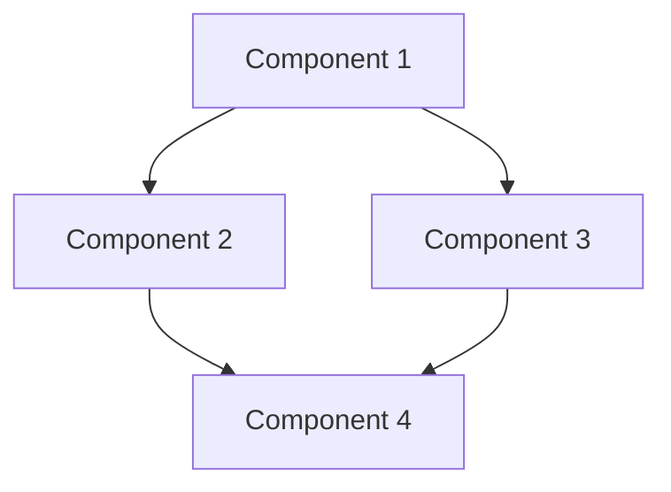
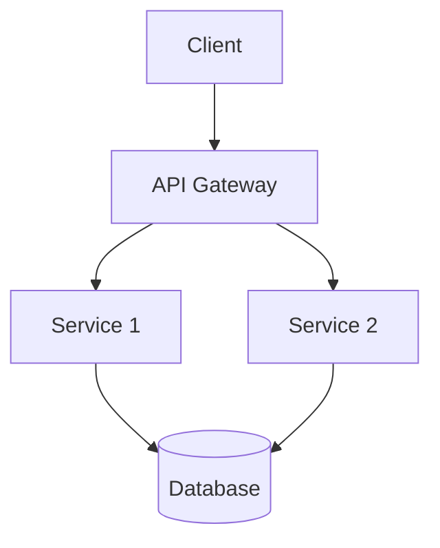

# Architecture - [PACKAGE_NAME]

**NOTE: When making changes to this template that would benefit all packages, please propagate these changes to all package-specific ARCHITECTURE.md files.**

## System Overview

[Provide a brief overview of the system, its purpose, and key features.]

## Core Components

[List and describe the major components of the system.]

- **Component 1**: Description of Component 1
- **Component 2**: Description of Component 2
- **Component 3**: Description of Component 3

## Component Relationships

[Describe how the components interact with each other.]



## Data Flow

[Describe how data flows through the system.]

1. Step 1: Description of Step 1
2. Step 2: Description of Step 2
3. Step 3: Description of Step 3

## Key Interfaces

[Document the key interfaces between components.]

### Interface 1

```typescript
interface ExampleInterface {
  method1(param1: string): Promise<Result>;
  method2(param1: number, param2: boolean): void;
  property1: string;
}
```

### Interface 2

```typescript
interface AnotherInterface {
  method1(param1: InputType): OutputType;
  // Add more methods as needed
}
```

## Design Decisions

[Document important design decisions and their rationales.]

### Decision 1: [Title]

**Context**: [Describe the context in which the decision was made.]

**Decision**: [Describe the decision that was made.]

**Rationale**: [Explain why this decision was made.]

**Consequences**: [Describe the consequences of this decision.]

### Decision 2: [Title]

**Context**: [Describe the context in which the decision was made.]

**Decision**: [Describe the decision that was made.]

**Rationale**: [Explain why this decision was made.]

**Consequences**: [Describe the consequences of this decision.]

## Technology Stack

[List the technologies used in the project.]

- **Language**: TypeScript
- **Runtime**: Node.js/Bun
- **Testing**: Vitest
- **Build Tools**: Bun
- **Other Libraries**: [List relevant libraries and frameworks]

## Deployment Architecture

[Describe how the system is deployed.]



## Performance Considerations

[Document any performance considerations.]

- Consideration 1
- Consideration 2
- Consideration 3

## Security Considerations

[Document any security considerations.]

- Security Consideration 1
- Security Consideration 2
- Security Consideration 3

## Error Handling

[Describe the approach to error handling.]

```typescript
// Example error handling pattern
try {
  await someOperation();
} catch (error) {
  if (error instanceof SpecificError) {
    // Handle specific error
  } else {
    // Handle general error
  }
}
```

## Monitoring and Logging

[Describe the approach to monitoring and logging.]

- Logging approach
- Monitoring tools
- Alert mechanisms

## Future Improvements

[List potential future improvements.]

- Improvement 1
- Improvement 2
- Improvement 3

## References

[List any references used in the architecture.]

1. Reference 1
2. Reference 2
3. Reference 3